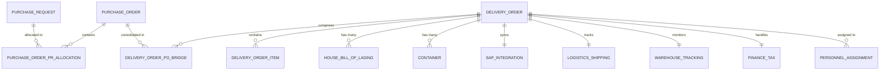

# 00. Tổng quan dự án quản lý nhập hàng nhà máy

## 1. Mục tiêu

Xây dựng frontend MVP để demo quy trình nhập hàng nhà máy: từ lúc bộ phận sản xuất tạo Purchase Request đến khi hàng nhập kho và personnel hoàn tất task liên quan. Hệ thống hỗ trợ quản lý mối quan hệ phức tạp giữa yêu cầu mua hàng, đơn hàng và lô hàng thực tế.

## 2. Phạm vi nghiệp vụ (5 Giai đoạn)

1. **Procurement (PR & PO):** Production tạo `Purchase Request` (PR). Purchasing tổng hợp PR để tạo `Purchase Order` (PO) trên SAP. Một PR có thể được phân bổ vào nhiều PO và ngược lại (**n-n**).
2. **Logistics Initiation (DO & Booking):** `Delivery Order` (DO) đại diện cho lô hàng thực tế, có thể gom hàng từ nhiều PO (**n-n**). Forwarder thực hiện Booking và SI.
3. **Documentation & Tracking (HBL & Manifest):** Kiểm tra chứng từ (CI, PL, B.L). Một DO có thể chứa nhiều `House Bill of Lading` (HBL) và nhiều `Container`.
4. **Customs & Port Execution:** Khai báo hải quan (Luồng Xanh/Vàng/Đỏ) và xử lý tại cảng (Telex Release, lấy D.O).
5. **Closing & Reconciliation:** Nhập kho thực tế, tính toán `delay_days` và đối soát tài chính.

## 3. Thực thể chính

| Thực thể | Mô tả |
|---|---|
| Purchase Request | Yêu cầu mua hàng do Production tạo |
| Purchase Order | Đơn mua hàng do Purchasing tạo với nhà cung cấp |
| Delivery Order | Shipment/lot thực tế, đơn vị quản lý công việc (Job) |
| HBL | House Bill of Lading, vận đơn thứ cấp thuộc DO |
| Container | Container chứa hàng thuộc DO |
| SAP Integration | Mã NCC, mã hàng thực tế và số PO từ SAP |
| Logistics Shipping | Vessel, ETD/ETA, Booking, SI và chứng từ |
| Warehouse Tracking | Deadline, ngày nhập kho thực tế và `delay_days` |
| Finance Tax | Thuế nhập khẩu, hạn nộp thuế và bảo hiểm |
| Personnel Task | Công việc theo role, assignee, progress và completed date |

## 4. Quan hệ dữ liệu (New Model)

## 5. Quy ước

- Ngày tháng dùng ISO date string `YYYY-MM-DD`.
- Trường chưa có dữ liệu có thể là `null`.
- Schema keys giữ tiếng Anh; UI text dùng tiếng Việt.
- `status` dùng uppercase enum.
- `progress` là số từ `0` đến `100`.
- Mối quan hệ n-n được xử lý qua các bảng bridge hoặc list IDs ở frontend mock.

## 6. Module frontend

| Module | Trách nhiệm |
|---|---|
| `purchase-request` | Danh sách, chi tiết và tạo PR |
| `purchase-order` | Quản lý PO và phân bổ PR vào PO |
| `delivery-order` | Quản lý lô hàng (Job), HBL, Container và Items |
| `logistics` | Booking, SI, Vessel, ETD/ETA, cảng đi/đến |
| `warehouse` | Deadline, actual entry và delay days |
| `finance-tax` | Thuế nhập khẩu, hạn nộp và phí (Charges) |
| `personnel-task` | Assignee, task progress và completed date |
| `reporting` | KPI trễ hạn, trạng thái shipment và tiến độ task |
