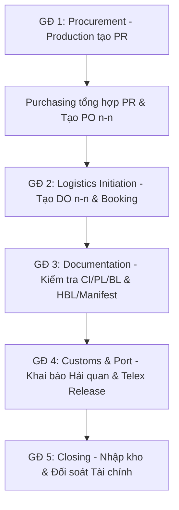

# 04. Workflow rules quản lý nhập hàng

## 1. Luồng chính (5 Giai đoạn)



## 2. PR/PO rules (n-n)

- PR bắt đầu từ nhu cầu vật tư thực tế.
- Purchasing có thể gom nhiều PR vào một PO để tối ưu số lượng đặt hàng.
- Một PR có thể được tách ra nhiều PO nếu mua từ nhiều nhà cung cấp.
- Status PR: `NEW`, `APPROVED`, `PROCESSING` (khi đã có PO), `COMPLETED` (khi DO liên quan đã nhập kho), `CANCELLED`.

## 3. PO/DO rules (n-n)

- Một DO (Job) đại diện cho một lô hàng vận chuyển thực tế.
- Một DO có thể gom hàng từ nhiều PO (**Consolidation**) để tiết kiệm chi phí vận tải.
- Một PO có thể được giao thành nhiều đợt (nhiều DO) nếu hàng về không đồng loạt.
- DO quản lý thông tin HBL, Container và các mốc thời gian (ETD/ETA).

## 4. Logistics, Warehouse và Finance-tax

| Phân hệ | Theo dõi |
|---|---|
| `sap_integration` | Đồng bộ mã NCC, mã hàng và số PO từ SAP |
| `logistics_shipping` | Booking, SI, Vessel, ETD/ETA, Cảng đi/đến, MBL/HBL |
| `warehouse_tracking` | Deadline, actual entry và `delay_days` |
| `finance_tax` | Thuế nhập khẩu, hạn nộp thuế, bảo hiểm và phí (Charges) |

SOP logistics yêu cầu phản hồi báo giá trong 1 giờ và lấy Booking trong 8 giờ. Kiểm tra hồ sơ chứng từ trong 1 giờ.

## 5. Personnel rules

- Role chuẩn: `pic_manager`, `sale_staff`, `port_officer`, `customs_officer`.
- Personnel cập nhật `progress` cho từng công đoạn.
- **Completion Rule:** DO chỉ được chuyển sang `COMPLETED` khi `actual_entry_date` đã có dữ liệu VÀ tất cả các task của Personnel liên quan đã đạt 100% progress.

## 6. State transition DO

```text
DRAFT
  -> PO_CREATED (Đã link với ít nhất 1 PO)
  -> IN_TRANSIT (Đã chạy tàu / có ETD actual)
  -> CUSTOMS_PROCESSING (Đã đến cảng / Khai hải quan)
  -> WAREHOUSE_RECEIVED (Đã nhập kho thực tế)
  -> COMPLETED (Đã xong thủ tục & tasks)
```

`DELAYED` dùng khi shipment hoặc warehouse entry trễ so với deadline.

## 7. Delay rule

```text
Nếu actual warehouse entry date có dữ liệu:
  delay_days = max(0, actual warehouse entry date - warehouse deadline)
Ngược lại nếu ETA actual/planned có dữ liệu:
  delay_days = max(0, ETA date - warehouse deadline)
Ngược lại:
  delay_days = 0
```

## 8. Điều kiện hoàn tất DO

- Hàng đã nhập kho thực tế (`warehouse_tracking.actual_entry_date`).
- Tất cả Personnel Tasks liên quan đã được cập nhật 100% progress.
- Status chuyển sang `COMPLETED`.
